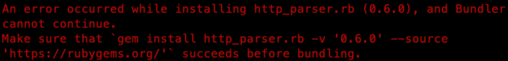
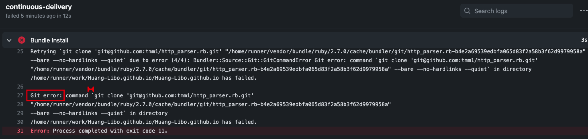

# 架构简介

`Jekyll` + `Chirpy Theme`

# Jekyll 相关文档

https://jekyllrb.com/

# Jekyll 启动本地 server

方法一：在 `vscode` 内使用 [Jekyll Run](https://marketplace.visualstudio.com/items?itemName=Dedsec727.jekyll-run) 插件一键启动。  

方法二：在 `Terminal` 内启动：

```
bundle exec jekyll serve --drafts
```

# Chirpy Theme 相关文档

**chirpy live demo**（包含一些使用说明）：https://chirpy.cotes.info/  

**chirpy project**（包含 live demo 的源码）：https://github.com/cotes2020/jekyll-theme-chirpy  

**startup template for Jekyll Theme Chirpy**（包含新建站点需要的素材，也可用来 debug）：https://github.com/cotes2020/chirpy-starter

这些站点也使用了 Chirpy Theme，可前往观摩：  

- https://onevcat.com/

# Chirpy Theme 集成的方式

[本站点是使用RubyGems 方式安装的 Chirpy Theme](https://github.com/cotes2020/jekyll-theme-chirpy/blob/master/docs/README.zh-CN.md#rubygems-%E5%AE%89%E8%A3%85)。   

如果要升级主题，则去 `Gemfile` 中修改版本号：  

```
gem "jekyll-theme-chirpy", "~> 4.0"
```

然后执行 `bundle install`。  

如果要主动进行小版本升级，可执行：  

```
bundle update jekyll-theme-chirpy
```

查看主题中其他文件的信息：  

```
bundle info --path jekyll-theme-chirpy
```

# Chirpy Theme 自定义图标 favicon

在站点的 `/assets/img/favicons` 目录下添加图片资源，详情请参考文档：https://chirpy.cotes.info/posts/customize-the-favicon/  

# Chirpy Theme 的其他设置

Google 阅读人数统计在 `_config.yml` 中设置，目前还未设置。 

# 写博客：vscode 及相关插件

> 笔者最初用的是 MWeb，其 Markdown 相关快捷键较多，但其无法显示 Jekyll 中使用*绝对路径*的图片。 

vscode 中有有许多 Markdown 和 Jekyll 相关的插件，极大地提高了写文章的效率。  

下面列举一些笔者目前正在使用的插件。  

## Jekyll Run

https://marketplace.visualstudio.com/items?itemName=Dedsec727.jekyll-run  

可以在 vscode 内一键启动 Jekyll 服务。  

## Markdown Preview Enhanced

https://marketplace.visualstudio.com/items?itemName=shd101wyy.markdown-preview-enhanced  

这个插件可以显示 Jekyll中使用*绝对路径*的图片。   

# FAQ

## 站点的 favicon 显示不对

可以去 `_site` 目录下看看素材是否正确，路径是 `_site/assets/img/favicons`。  

生成的 favicon 素材来源于 `/assets/img/favicons` 目录，可将缺失的素材放入这个目录，然后重新构建站点。

## 已经修改了网站，但没生效

修改了网站的配置文件、图标，但刷新页面后没生效，可能是因为有缓存。  

- 如果是在桌面端使用 `Chrome`，则按 **cmd + Shift + R** 强制刷新页面。
- 如果是在 iPhone 上使用 `Safari`，则可以去 **设置 - Safari - 高级 - 网站数据** 中删除相关站点的缓存。

## 执行 `bundle install` 失败：http_parser.rb (0.6.0) 导致的问题



原因：路径中有**空格**引起的。

当前站点源文件的路径为：    

```
~/Library/Mobile Documents/iCloud~com~coderforart~iOS~MWeb/Documents/Huang-Libo.github.io
```

一个解决方案是将相应目录中的空格去掉，但是这是一个 **iCloud Driver** 的路径，修改它会导致 **iCloud Driver** 无法正常使用。  

这个问题是 `http_parser.rb` **0.6.0** 版本的 bug 引起的，已经在其 master 分支上修复了，但未打 tag 发布新版本。    

解决方案：  

在 `Gemfile` 中添加：  

```ruby
gem 'http_parser.rb', git: "git@github.com:tmm1/http_parser.rb.git"
```

参考连接：  

- https://github.com/tmm1/http_parser.rb/issues/47#issuecomment-544196403

**补充说明**：  

这个改动只能在本地 `bundle install` 时使用，不要提交到 GitHub，否则会构建失败（可能是不支持这种集成方式）：  

 

## 修改 RubyGems 源

如果当前网络连默认源比较慢的话，可以考虑切换为国内源。

- Ruby China 源（推荐）：https://gems.ruby-china.com/
- 清华大学源：https://mirrors.tuna.tsinghua.edu.cn/help/rubygems/

相关配置文件：  

- `~/.gemrc`：RubyGems 的配置
- `~/.bundle/config`：bundler 的配置，可查看其镜像设置

注意：切换了 RubyGems 镜像之后，bundler 镜像也要单独配置。切换回默认源时，记得去 `.bundle/config` 中把镜像的配置删掉。  

配置 bundler 镜像的语法规则：  

```
bundle config mirror.https://rubygems.org https://<rubygems-mirror.org>

```

bundler 镜像配置的官方文档： http://bundler.io/v1.16/man/bundle-config.1.html#MIRRORS-OF-GEM-SOURCES  

## bundle 相关设置

如果 `bundle install` 时不想使用 `sudo`，可指定 **local path**：  

```
bundle config set --local path 'vendor/bundle'
```

然后再执行 `bundle install`。  
