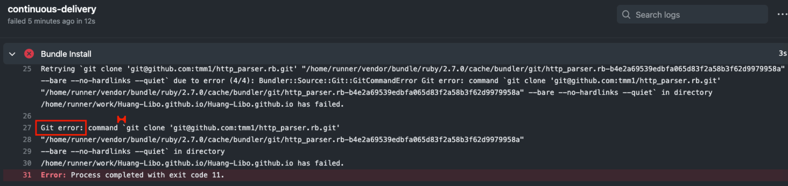

- [Blog 架构简介](#blog-架构简介)
- [Jekyll 相关文档](#jekyll-相关文档)
- [下载 & 安装依赖](#下载--安装依赖)
- [Jekyll 启动本地 server](#jekyll-启动本地-server)
- [Chirpy Theme](#chirpy-theme)
  - [Chirpy Theme 相关文档](#chirpy-theme-相关文档)
  - [Chirpy Theme 集成的方式](#chirpy-theme-集成的方式)
  - [Chirpy Theme 自定义图标 favicon](#chirpy-theme-自定义图标-favicon)
  - [Chirpy Theme 的其他设置](#chirpy-theme-的其他设置)
- [写博客：vscode 及相关插件](#写博客vscode-及相关插件)
  - [Jekyll Run](#jekyll-run)
  - [Markdown Preview Enhanced](#markdown-preview-enhanced)
  - [Markdown All in One](#markdown-all-in-one)
- [FAQ](#faq)
  - [站点的 favicon 显示不对](#站点的-favicon-显示不对)
  - [已经修改了网站，但没生效](#已经修改了网站但没生效)
  - [执行 bundle install 失败：http_parser.rb (0.6.0) 导致的问题](#执行-bundle-install-失败http_parserrb-060-导致的问题)
  - [修改 RubyGems 源](#修改-rubygems-源)
  - [bundle 相关设置](#bundle-相关设置)
  - [nokogumbo 报错](#nokogumbo-报错)
  - [在多台 Mac 上写作时同步文件](#在多台-mac-上写作时同步文件)
  - [两台 Mac 上 bundler 版本不一致导致的问题](#两台-mac-上-bundler-版本不一致导致的问题)
  - [rvm 相关操作](#rvm-相关操作)

# Blog 架构简介

`Jekyll` + `Chirpy Theme`

# Jekyll 相关文档

https://jekyllrb.com/

# 下载 & 安装依赖

重要：将仓库 *clone* 到**路径中不含空格**的目录中，以规避 `http_parser.rb` **0.6.0** 版本的 bug。  

在项目根目录下执行 `bundle install` 。

# Jekyll 启动本地 server

方法一：在 `vscode` 内使用 [Jekyll Run](https://marketplace.visualstudio.com/items?itemName=Dedsec727.jekyll-run) 插件一键启动。  

方法二：在 `Terminal` 内启动：

```
bundle exec jekyll serve --drafts
```

# Chirpy Theme 

## Chirpy Theme 相关文档

**chirpy live demo**（包含一些使用说明）：https://chirpy.cotes.info/  

**chirpy project**（包含 live demo 的源码）：https://github.com/cotes2020/jekyll-theme-chirpy  

**startup template for Jekyll Theme Chirpy**（包含新建站点需要的素材，也可用来 debug）：https://github.com/cotes2020/chirpy-starter

这些站点也使用了 Chirpy Theme，可前往观摩：  

- https://onevcat.com/

## Chirpy Theme 集成的方式

[本站点是使用RubyGems 方式安装的 Chirpy Theme](https://github.com/cotes2020/jekyll-theme-chirpy/blob/master/docs/README.zh-CN.md#rubygems-%E5%AE%89%E8%A3%85)。   

如果要升级主题，则去 `Gemfile` 中修改版本号：  

```
gem "jekyll-theme-chirpy", "~> 4.0"
```

然后执行 `bundle install`。  

如果要主动进行小版本升级，可执行：  

```
bundle update jekyll-theme-chirpy
```

查看主题中其他文件的信息：  

```
bundle info --path jekyll-theme-chirpy
```

## Chirpy Theme 自定义图标 favicon

在站点的 `/assets/img/favicons` 目录下添加图片资源，详情请参考文档：https://chirpy.cotes.info/posts/customize-the-favicon/  

## Chirpy Theme 的其他设置

Google 阅读人数统计在 `_config.yml` 中设置，目前还未设置。 

# 写博客：vscode 及相关插件

> 笔者最初用的是 MWeb，其 Markdown 相关快捷键较多，但其无法显示 Jekyll 中使用*绝对路径*的图片。 

vscode 中有有许多 Markdown 和 Jekyll 相关的插件，极大地提高了写文章的效率。  

下面列举一些笔者目前正在使用的插件。  

## Jekyll Run

https://marketplace.visualstudio.com/items?itemName=Dedsec727.jekyll-run  

可以在 vscode 内一键启动 Jekyll 服务。  

## Markdown Preview Enhanced

https://marketplace.visualstudio.com/items?itemName=shd101wyy.markdown-preview-enhanced  

这个插件可以显示 Jekyll中使用*绝对路径*的图片。   

快捷键：  

- 预览：<kbd>Command</kbd> + <kbd>K</kbd> ，<kbd>V</kbd>

## Markdown All in One

https://marketplace.visualstudio.com/items?itemName=yzhang.markdown-all-in-one

功能：  

- 快捷键
  - 加粗：<kbd>Command</kbd> + <kbd>B</kbd>
  - 斜体：<kbd>Command</kbd> + <kbd>I</kbd>
- 添加图片时有路径自动补全
- 预览

# FAQ

## 站点的 favicon 显示不对

可以去 `_site` 目录下看看素材是否正确，路径是 `_site/assets/img/favicons`。  

生成的 favicon 素材来源于 `/assets/img/favicons` 目录，可将缺失的素材放入这个目录，然后重新构建站点。

## 已经修改了网站，但没生效

修改了网站的配置文件、图标，但刷新页面后没生效，可能是因为有缓存。  

- 如果是在桌面端使用 `Chrome`，则按 **cmd + Shift + R** 强制刷新页面。
- 如果是在 iPhone 上使用 `Safari`，则可以去 **设置 - Safari - 高级 - 网站数据** 中删除相关站点的缓存。

## 执行 bundle install 失败：http_parser.rb (0.6.0) 导致的问题


原因：路径中有**空格**引起的。

当前站点源文件的路径为：    

```
~/Library/Mobile Documents/iCloud~com~coderforart~iOS~MWeb/Documents/Huang-Libo.github.io
```

一个解决方案是将相应目录中的空格去掉，但是这是一个 **iCloud Driver** 的路径，修改它会导致 **iCloud Driver** 无法正常使用。  

这个问题是 `http_parser.rb` **0.6.0** 版本的 bug 引起的，已经在其 master 分支上修复了，但未打 tag 发布新版本。    

解决方案：  

在 `Gemfile` 中添加：  

```ruby
gem 'http_parser.rb', git: "git@github.com:tmm1/http_parser.rb.git"
```

参考连接：  

- https://github.com/tmm1/http_parser.rb/issues/47#issuecomment-544196403

**补充说明**：  

这个改动只能在本地 `bundle install` 时使用，不要提交到 GitHub，否则会构建失败（可能是不支持这种集成方式）：  

 

## 修改 RubyGems 源

如果当前网络连默认源比较慢的话，可以考虑切换为国内源。

- Ruby China 源（推荐）：https://gems.ruby-china.com/
- 清华大学源：https://mirrors.tuna.tsinghua.edu.cn/help/rubygems/

相关配置文件：  

- `~/.gemrc`：RubyGems 的配置
- `~/.bundle/config`：bundler 的配置，可查看其镜像设置

注意：切换了 RubyGems 镜像之后，bundler 镜像也要单独配置。切换回默认源时，记得去 `.bundle/config` 中把镜像的配置删掉。  

配置 bundler 镜像的语法规则：  

```
bundle config mirror.https://rubygems.org https://<rubygems-mirror.org>

```

bundler 镜像配置的官方文档： http://bundler.io/v1.16/man/bundle-config.1.html#MIRRORS-OF-GEM-SOURCES  

## bundle 相关设置

如果 `bundle install` 时不想使用 `sudo`，可指定 **local path**：  

```
bundle config set --local path 'vendor/bundle'
```

然后再执行 `bundle install`。  

## nokogumbo 报错

执行 `bundle install` 时，`nokogumbo` 报错：  

```
An error occurred while installing nokogumbo (2.0.5), and Bundler cannot continue.
Make sure that `gem install nokogumbo -v '2.0.5' --source 'https://rubygems.org/'` succeeds
before bundling.

In Gemfile:
  html-proofer was resolved to 3.19.1, which depends on
    nokogumbo
```

按照提示执行 `gem install nokogumbo -v '2.0.5' --source 'https://rubygems.org/` 还是不行。  

解决方法：把 `vendor/bundle` 目录删除，再执行 `bundle install` 就可以了。  

## 在多台 Mac 上写作时同步文件

场景：在公司和家里各有一台 *Mac*，在未 *commit* 前，修改的内容需要在两台设备上同步。  

最好使用 *Dropbox* ，*iCloud Driver* 还是不太靠谱。特别是小文件很多的时候，*Dropbox* 的可用性、稳定性都更好，并且可以看到单个文件的同步状态。  

## 两台 Mac 上 bundler 版本不一致导致的问题

> 家里和公司的 Mac 是通过 Dropbox 同步笔记的。

前一天晚上在家里的 Mac 上写了点笔记，第二天用公司的 Mac 继续写，执行 `bundle exec jekyll server` 时报错：  

```
Traceback (most recent call last):
	17: from $HOME/.rvm/gems/ruby-2.6.5/bin/ruby_executable_hooks:22:in `<main>'
	16: from $HOME/.rvm/gems/ruby-2.6.5/bin/ruby_executable_hooks:22:in `eval'
	15: from $HOME/$BLOG/vendor/bundle/ruby/2.6.0/bin/jekyll:23:in `<main>'
	14: from $HOME/$BLOG/vendor/bundle/ruby/2.6.0/bin/jekyll:23:in `load'
	13: from $HOME/$BLOG/vendor/bundle/ruby/2.6.0/gems/jekyll-4.2.0/exe/jekyll:8:in `<top (required)>'
	12: from $HOME/$BLOG/vendor/bundle/ruby/2.6.0/gems/jekyll-4.2.0/exe/jekyll:8:in `require'
	11: from $HOME/$BLOG/vendor/bundle/ruby/2.6.0/gems/jekyll-4.2.0/lib/jekyll.rb:195:in `<top (required)>'
	10: from $HOME/$BLOG/vendor/bundle/ruby/2.6.0/gems/jekyll-4.2.0/lib/jekyll.rb:195:in `require'
	 9: from $HOME/$BLOG/vendor/bundle/ruby/2.6.0/gems/jekyll-sass-converter-2.1.0/lib/jekyll-sass-converter.rb:4:in `<top (required)>'
	 8: from $HOME/$BLOG/vendor/bundle/ruby/2.6.0/gems/jekyll-sass-converter-2.1.0/lib/jekyll-sass-converter.rb:4:in `require'
	 7: from $HOME/$BLOG/vendor/bundle/ruby/2.6.0/gems/jekyll-sass-converter-2.1.0/lib/jekyll/converters/scss.rb:3:in `<top (required)>'
	 6: from $HOME/$BLOG/vendor/bundle/ruby/2.6.0/gems/jekyll-sass-converter-2.1.0/lib/jekyll/converters/scss.rb:3:in `require'
	 5: from $HOME/$BLOG/vendor/bundle/ruby/2.6.0/gems/sassc-2.4.0/lib/sassc.rb:31:in `<top (required)>'
	 4: from $HOME/$BLOG/vendor/bundle/ruby/2.6.0/gems/sassc-2.4.0/lib/sassc.rb:31:in `require_relative'
	 3: from $HOME/$BLOG/vendor/bundle/ruby/2.6.0/gems/sassc-2.4.0/lib/sassc/native.rb:3:in `<top (required)>'
	 2: from $HOME/$BLOG/vendor/bundle/ruby/2.6.0/gems/sassc-2.4.0/lib/sassc/native.rb:3:in `require'
	 1: from $HOME/$BLOG/vendor/bundle/ruby/2.6.0/gems/ffi-1.15.1/lib/ffi.rb:3:in `<top (required)>'
$HOME/$BLOG/vendor/bundle/ruby/2.6.0/gems/ffi-1.15.1/lib/ffi.rb:3:in `require': cannot load such file -- 2.6/ffi_c (LoadError)
	18: from $HOME/.rvm/gems/ruby-2.6.5/bin/ruby_executable_hooks:22:in `<main>'
	17: from $HOME/.rvm/gems/ruby-2.6.5/bin/ruby_executable_hooks:22:in `eval'
	16: from $HOME/$BLOG/vendor/bundle/ruby/2.6.0/bin/jekyll:23:in `<main>'
	15: from $HOME/$BLOG/vendor/bundle/ruby/2.6.0/bin/jekyll:23:in `load'
	14: from $HOME/$BLOG/vendor/bundle/ruby/2.6.0/gems/jekyll-4.2.0/exe/jekyll:8:in `<top (required)>'
	13: from $HOME/$BLOG/vendor/bundle/ruby/2.6.0/gems/jekyll-4.2.0/exe/jekyll:8:in `require'
	12: from $HOME/$BLOG/vendor/bundle/ruby/2.6.0/gems/jekyll-4.2.0/lib/jekyll.rb:195:in `<top (required)>'
	11: from $HOME/$BLOG/vendor/bundle/ruby/2.6.0/gems/jekyll-4.2.0/lib/jekyll.rb:195:in `require'
	10: from $HOME/$BLOG/vendor/bundle/ruby/2.6.0/gems/jekyll-sass-converter-2.1.0/lib/jekyll-sass-converter.rb:4:in `<top (required)>'
	 9: from $HOME/$BLOG/vendor/bundle/ruby/2.6.0/gems/jekyll-sass-converter-2.1.0/lib/jekyll-sass-converter.rb:4:in `require'
	 8: from $HOME/$BLOG/vendor/bundle/ruby/2.6.0/gems/jekyll-sass-converter-2.1.0/lib/jekyll/converters/scss.rb:3:in `<top (required)>'
	 7: from $HOME/$BLOG/vendor/bundle/ruby/2.6.0/gems/jekyll-sass-converter-2.1.0/lib/jekyll/converters/scss.rb:3:in `require'
	 6: from $HOME/$BLOG/vendor/bundle/ruby/2.6.0/gems/sassc-2.4.0/lib/sassc.rb:31:in `<top (required)>'
	 5: from $HOME/$BLOG/vendor/bundle/ruby/2.6.0/gems/sassc-2.4.0/lib/sassc.rb:31:in `require_relative'
	 4: from $HOME/$BLOG/vendor/bundle/ruby/2.6.0/gems/sassc-2.4.0/lib/sassc/native.rb:3:in `<top (required)>'
	 3: from $HOME/$BLOG/vendor/bundle/ruby/2.6.0/gems/sassc-2.4.0/lib/sassc/native.rb:3:in `require'
	 2: from $HOME/$BLOG/vendor/bundle/ruby/2.6.0/gems/ffi-1.15.1/lib/ffi.rb:2:in `<top (required)>'
	 1: from $HOME/$BLOG/vendor/bundle/ruby/2.6.0/gems/ffi-1.15.1/lib/ffi.rb:5:in `rescue in <top (required)>'
$HOME/$BLOG/vendor/bundle/ruby/2.6.0/gems/ffi-1.15.1/lib/ffi.rb:5:in `require': incompatible library version - $HOME/$BLOG/vendor/bundle/ruby/2.6.0/gems/ffi-1.15.1/lib/ffi_c.bundle (LoadError)
```

从报错前两行的 `$HOME/.rvm/gems/ruby-2.6.5` 中可以看出，当前 *Mac* 使用的 ruby 版本是 `2.6.5` 。  

而后面的 `$BLOG/vendor/bundle/ruby/2.6.0` **不是**说 `bundle install` 时使用的 *ruby* 版本是 `2.6.0` ，所有 `2.6.x` 小版本在这个目录上都会显示成 `2.6.0` 。  

不过最好还是保持两台 *Mac* 上的 *ruby* 版本保持一致。  

再执行 `bundle install` ，出现了 **Warning** ：  

```
❯ bundle install
Warning: the running version of Bundler (2.1.4) is older than the version that created the lockfile (2.2.17). We suggest you to upgrade to the version that created the lockfile by running `gem install bundler:2.2.17`.
```

原因是 `Gemfile.lock` 中指定的 *bundle* 版本是 `2.2.17` ，而当前 Mac 使用的 版本是 `2.1.4` 。在 `Gemfile.lock` 最下面有 *bundler* 相关信息：  

```
BUNDLED WITH
   2.2.17
```

先执行 `gem install bundler:2.2.17` 在当前 *Mac* 上安装指定版本的 *bundler* 。  

删除 `vendor/bundle` 目录，再执行 `bundle install` ，完成后，执行 `bundle exec jekyll server` ，就可以了。  

**结论：两台电脑的 ruby 版本、bundler 版本最好保持一致。**

## rvm 相关操作

查看本机已安装的版本：  

```
rvm list
```

查看云端所有的版本：  

```
rvm list know
```

安装指定的版本：  

```
rvm install 2.7.3
```

切换版本：  

```
rvm use 2.7.2
```

切换版本并设置成 default：  

```
rvm --default use 2.7.2
```

参考：http://homeway.github.io/tutorial/rvm.html
